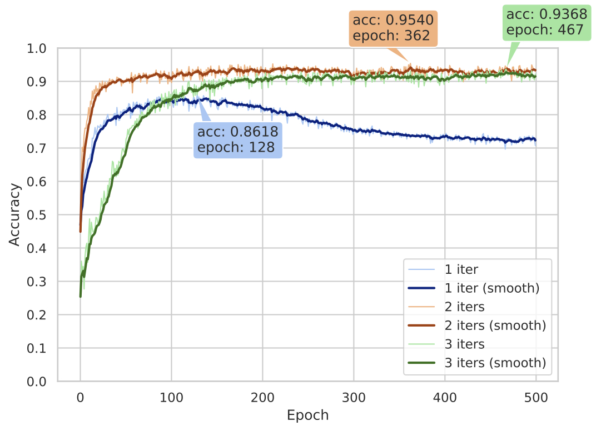

# Implementation of "Matrix Capsules with EM Routing"

A TensorFlow implementation of [Matrix Capsules with EM Routing](https://openreview.net/pdf?id=HJWLfGWRb) by Hinton *et al.* (2018).


This implementation fixes a number of common issues that were found in other open-source implementations, the main ones being:

1. Parent capsules at different spatial positions compete for child capsules
2. Numerical instability due to parent capsules with only one child
3. Normalising the amount of data assigned to parent capsules

If you would like more information about these issues, please refer to the associated [paper](https://arxiv.org/pdf/1907.00652.pdf) and blog (coming soon).

# Usage

**Step 1.** Download this repository with ``git`` or click the [download ZIP](https://github.com/IBM/matrix-capsules-with-em-routing/archive/master.zip) button.

```
$ git clone https://github.com/IBM/matrix-capsules-with-em-routing.git
$ cd matrix-capsules-with-em-routing
```


**Step 2.** Download [smallNORB](https://cs.nyu.edu/~ylclab/data/norb-v1.0-small/) dataset.

```
$ chmod +x data/download.sh
$ ./data/download.sh
```

The download is 251MB which will then be unzipped to about 856MB. The six ```.mat``` files are placed in the directory ```data/smallNORB/mat```. 


**Step 3.** Set up the environment with Anaconda. (See [here](https://docs.anaconda.com/anaconda/install/linux/) for instructions on how to install Anaconda.)

With Anaconda (recommended):
```
$ conda env create -f capsenv.yml
$ conda activate capsenv
```

Without Anaconda:
```
$ pip install --requirement requirements.txt
```

**Step 4.** Generate TFRecord for train and test datasets from ```.mat``` files.

```
$ python ./data/convert_to_tfrecord.py
```

The resulting TFRecords are about 3.4GB each. The TensorFlow api employs multithreading, so this process should be fast (within a minute). If you are planning to commit to GitHub, make sure to ignore these files as they are too large to upload. The ```.tfrecord``` files for train and test datasets are placed in the ```data/smallNORB/tfrecord``` directory.  

If you receive the errors:  
```Bus error (core dumped) python ./convert_to_tfrecord.py``` or   
```Killed python ./convert_to_tfrecord.py```  
these most likely indicate that you have insufficient memory (8GB should be enough), and you should try the sharded approach.


**Step 5.** Start the training and validation on smallNORB.

```
$ python train_val.py
```

If you need to monitor the training process, open tensorboard with this command.
```
$ tensorboard --logdir=./logs
```

To get the full list of command line flags, ```python train_val.py --helpfull```

**Step 6.** Calculate test accuracy. Make sure to specify the actual path to your directory, the directory below ```"./logs/smallNORB/20190731_wip"``` is just an example.

```
$ python test.py --load_dir="./logs/smallNORB/20190731_wip"
```

# Results

The graph below shows the test accuracy of our implementation after each training epoch for 1–3 iterations of EM routing. We achieve our best accuracy of 95.4\% with 2 routing iterations, and with 3 iterations we get 93.7\%. The table shows how our results stack up to other open source implementations available on GitHub: [yl-1993](https://github.com/yl-1993/Matrix-Capsules-EM-PyTorch), [www0wwwjs1](https://github.com/www0wwwjs1/Matrix-Capsules-EM-Tensorflow), [Officium](https://github.com/Officium/Capsules) (as recorded on 28 May 2019). The accuracy of our implementation at 95.4\% is a 3.8 percentage point improvement on the previous best open source implementation at 91.8\%, however it is still a bit below the accuracy of Hinton *et al.* at 97.8\%. To our knowledge, our implementation is currently the best open-source implementation available.



| Implementation	| Framework     | Routing iterations | Test accuracy |
| -------------     | ------------- | ------------------ | ------------- |
| [Hinton]((https://openreview.net/pdf?id=HJWLfGWRb)) | Not available | 3 | **97.8\%** |
| [yl-1993](https://github.com/yl-1993/Matrix-Capsules-EM-PyTorch) | PyTorch | 1 | 74.8\% |
| [yl-1993](https://github.com/yl-1993/Matrix-Capsules-EM-PyTorch) | PyTorch | 2 | 89.5\% |
| [yl-1993](https://github.com/yl-1993/Matrix-Capsules-EM-PyTorch) | PyTorch | 3 | 82.5\% |
| [www0wwwjs1](https://github.com/www0wwwjs1/Matrix-Capsules-EM-Tensorflow)	| Tensorflow | 2 | 91.8\% |
| [Officium](https://github.com/Officium/Capsules) | PyTorch | 3 | 90.9\%
| Ours | TensorFlow 	| 1 | 86.2\% |
| Ours | TensorFlow 	| 2 | **95.4\%** |
| Ours | TensorFlow 	| 3 | 93.7\% |


# Implementation Details

If you would like more information on the implementation details, please refer to the associated [paper](https://arxiv.org/pdf/1907.00652.pdf) and blog (coming soon).

# Acknowledgements

1. [Jonathan Hui's blog](https://jhui.github.io/2017/11/14/Matrix-Capsules-with-EM-routing-Capsule-Network/), "Understanding Matrix capsules with EM Routing (Based on Hinton's Capsule Networks)"
2. [Questions and answers](https://openreview.net/forum?id=HJWLfGWRb) on OpenReview, "Matrix capsules with EM routing"
3. [Suofei Zhang's implementation](https://github.com/www0wwwjs1/Matrix-Capsules-EM-Tensorflow) on GitHub, "Matrix-Capsules-EM-Tensorflow" 
4. [Guang Yang's implementation](https://github.com/gyang274/capsulesEM) on GitHub, "CapsulesEM"

# How to Cite this Work

If you find this code useful in your academic work, please cite as follows:

A. Gritzman, "Avoiding Implementation Pitfalls of Matrix Capsules with EM Routing by Hinton et al.", in Joint Workshop on Human Brain and Artificial Intelligence (HBAI) at IJCAI'19, Macao, 2019.

Disclaimer: This is not an official IBM product.
